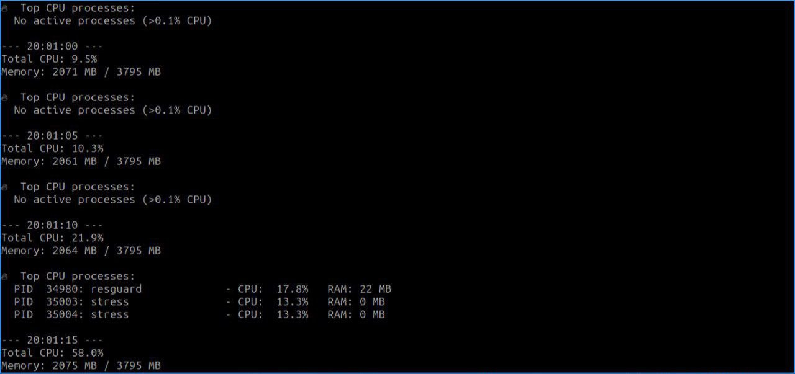

# Load-Monitor - System Load Monitor with Auto-Throttling

<div align="center">
  


**A production-ready system daemon that automatically detects and throttles resource-hungry processes using cgroups v2**



</div>

## Features

- **Real-time monitoring** of CPU, memory, and system load
- **Rule-based auto-throttling** with configurable thresholds and durations
- **cgroups v2 integration** for CPU and memory limits
- **Process whitelist/blacklist** support
- **Systemd service detection** for service-level limiting
- **Live process viewer** showing top CPU consumers
- **Comprehensive action logging** for audit trails

## Quick Start

# Clone and build
git clone https://github.com/NickIBrody/Loadmonitor.git
cd Loadmonitor
cargo build --release

# Run (use sudo for cgroups)
sudo ./target/release/resguard

# Configuration

Create config.toml in the project root:

[general]
interval_secs = 5
history_size = 1000

[limits]
cgroup_base_path = "/sys/fs/cgroup"
default_cpu_quota = 50.0
default_memory_limit = 1073741824
blacklist = ["systemd", "kernel", "init"]
whitelist = []

[[rules]]
name = "high-cpu"
duration_secs = 30
[rules.condition]
type = "CpuOver"
threshold = 90.0
[rules.action]
type = "LimitCpu"
max_percent = 40.0

[[rules]]
name = "high-memory"
duration_secs = 60
[rules.condition]
type = "MemoryOver"
threshold = 8589934592
[rules.action]
type = "LimitMemory"
max_bytes = 4294967296


# Stress Testing

Terminal 1 - Run Resguard

cd ~/Loadmonitor
sudo cargo run

Terminal 2 - Generate Load
# Install stress tool if needed
sudo apt install stress -y

# CPU stress test (4 cores for 2 minutes)
stress --cpu 4 --timeout 120

# Memory stress test (2 processes allocating 1GB each)
stress --vm 2 --vm-bytes 1G --timeout 60


# Expected Output
✅ Resguard started. Monitoring processes...
📊 Check interval: 5 sec
⚙️  Rules loaded: 2

--- 14:23:45 ---
Total CPU: 34.0%
Memory: 2111 MB / 3795 MB

🔥 Top CPU processes:
  PID  34706: resguard             - CPU:  16.7%   RAM: 21 MB
  PID  34912: stress               - CPU:  12.5%   RAM: 0 MB
  PID  34913: stress               - CPU:   8.3%   RAM: 0 MB
  PID   1182: Xorg                 - CPU:   4.2%   RAM: 44 MB

⚠️  APPLYING LimitCpu(40.0) to PID 34912 (stress) - CPU: 22.0%
✅ Limit applied


# 1. Common Issues & Solutions
 Permission Denied
Error: Permission denied (os error 13)
Solution: Run with sudo - cgroups require root:
sudo cargo run

# 2. TOML Parse Error
Error: TOML parse error - missing field `blacklist`
Solution: Ensure blacklist and whitelist are inside [limits] section.

# 3. No Processes Showing
🔥 Top CPU processes:
  No active processes (>0.1% CPU)


#  4. Compilation Errors

error: package `rayon-core` requires rustc 1.80 or newer

Solution: Update Rust:
rustup update stable


// Before
use sysinfo::{System};  // Methods not available

// After
use sysinfo::{System, SystemExt, CpuExt, PidExt};


TOML Structure
# Before (wrong)
blacklist = []

# After (correct)
[limits]
cgroup_base_path = "/sys/fs/cgroup"
blacklist = ["systemd"]

# Type System Fixes
// Path handling
let exe_string = exe_path.to_string_lossy().to_string();

// Type casting
RuleCondition::MemoryOver(*threshold as u64)

# License
MIT


# Project Structure

```text
Load-Monitor/
├── .gitignore
├── Cargo.toml
├── config.toml
├── LICENSE
├── README.md
├── screenshots/
│   └── (скрины всякие, ленивая жопа)
└── src/
    ├── config.rs
    ├── errors.rs
    ├── limiter/
    │   └── mod.rs
    ├── main.rs
    ├── metrics/
    │   └── mod.rs
    ├── process/
    │   └── mod.rs
    └── rules/
        └── mod.rs


